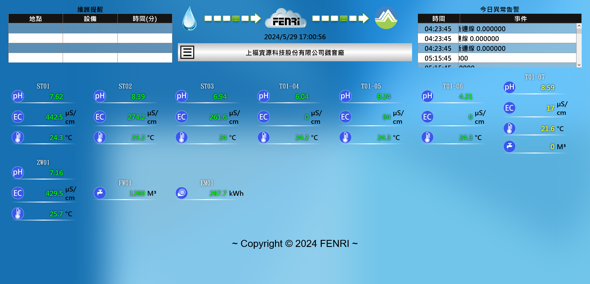

- [專案清單](#專案清單)
  - [環境部氣候變遷署----保水降溫監控系統平台](#環境部氣候變遷署----保水降溫監控系統平台)
  - [臺北科技大學----忠孝東路鋪面即時監測網](#臺北科技大學----忠孝東路鋪面即時監測網)
  - [CWMS水質自動監測視及連線傳輸系統](#cwms水質自動監測視及連線傳輸系統)
  - [桃園水務局自動連續監測](#桃園水務局自動連續監測)
  - [臺北市衛生下水道工程處----下水道管網監測](#臺北市衛生下水道工程處----下水道管網監測)
  - [安南污水下水道流量監測系統](#安南污水下水道流量監測系統)
  - [桃園農田灌溉水監測](#桃園農田灌溉水監測)
  - [環揚負壓式生活污水系統](#環揚負壓式生活污水系統)
  - [大鵬灣負壓式生活污水系統](#大鵬灣負壓式生活污水系統)
  - [開陽能源 IoT 監測](#開陽能源-iot-監測)

# 專案清單
此清單旨在記錄我所參與、設計、開發、維護的專案，並提供實作功能的介紹與連結。

## 環境部氣候變遷署----保水降溫監控系統平台
監控各地區溫度、濕度、雨量、地面下溫度等，確認花園的水循環與一般路面，在排水與降溫上的差異。
1. 首頁呈現各地區的地面溫差、貯水量。
2. 呈現各區域的溫度、濕度、雨量、地面下溫度、貯水槽情況。
3. 各區域歷史資料查詢。
4. i18n 中英文切換。
5. 諮詢表單接收、收尋、回覆、刪除。
6. 部分功能需登入。
7. 數值超限警告。
8. 斷線警告。
9. 透過電子郵件通知警告。
10. 帳號管理。

| 專案名稱                                   | 狀態   | 網址                             |
| ------------------------------------------ | ------ | -------------------------------- |
| 多功能智慧雨水花園「保水降溫監控系統平台」 | 使用中 | https://raingarden.moenv.gov.tw/ |

## 臺北科技大學----忠孝東路鋪面即時監測網
監測不同鋪面、不同深度的溫度差異，土地下水流，與氣象站資料；用於測試各種鋪面、各種深度的溫度時間變化，[保水降溫監控系統平台](#環境部氣候變遷署----保水降溫監控系統平台)的測試專案。
1. 鋪面不同深度的即時溫度。
2. 氣象站資料。
3. 出流口水深、流量。
4. 歷史資料。
5. 統計資料。

| 專案名稱               | 狀態   | 網址                                 |
| ---------------------- | ------ | ------------------------------------ |
| 忠孝東路鋪面即時監測網 | 使用中 | https://ntut.fenri.com.tw/zhongxiao/ |

## CWMS水質自動監測視及連線傳輸系統
定時監測進出流口水值，產生固定內容、名稱格式TXT文檔，並透過環境保護署的傳輸模組，將TXT文檔上傳至環保署的資料庫。  

必要功能如下：
1. 定時監測數值，並擷取數值。
2. 產生固定內容、名稱格式TXT文檔，至傳輸模組指定目錄。
3. 保存監測記錄。(歷史資料)
4. 全幅值。(近90日之有效監測數據日平均值)
5. 數值超限警告。
6. 警告紀錄。
7. 各監測項目狀態顯示、切換。  

附加功能：
1. 斷線警告。
2. 連線恢復通知。
3. 使用line notify通知。
4. 有效率計算。
5. 維護時長警告。
6. 部分功能需登入。

| 專案名稱                       | 狀態   | 網址         |
| ------------------------------ | ------ | ------------ |
| 上福資源科技股份有限公司觀音廠 | 使用中 | 僅供案場使用 |

## 桃園水務局自動連續監測
定時監測水質，並產生指定時間監測記錄值，實作水務局規定格式的API，由水務局使用 API取得監測紀錄值。

依建置規範，需具備以下四種API：
1. 取得特定時間之資料。
2. 取得某日期區間之資料。
3. 取得最近一個時間點的全部資料
4. 取得監測點基本資料。

需儲存以下資料：
1. 水廠基本資料。
2. 監測點資料。
3. 測項相關資料表。
4. 水質相關檢測資料。
5. 測項相關資料表基本資料。

為廠商方便查詢、監控水質，提供網站供廠商使用，功能如下：
1. 即時監測數值。
2. 監測記錄。
3. 數值超限警告。
4. 斷線警告。
5. line notify通知。
6. 警告紀錄。
7. 設備維護狀態切換。
8. 有效率計算。
9. 使用者登入。

| 專案名稱                           | 狀態   | 網址         |
| ---------------------------------- | ------ | ------------ |
| 中興電工自動連續監測系統           | 使用中 | 僅供案場使用 |
| 正和鋼鐵自動連續監測系統           | 使用中 | 僅供案場使用 |
| 台灣菸酒桃園印刷廠自動連續監測系統 | 使用中 | 僅供案場使用 |
| 爭鮮林口二廠自動連續監測系統       | 使用中 | 僅供案場使用 |
| 善笙生物自動連續監測系統           | 使用中 | 僅供案場使用 |
| 林口長庚水質自動連續監測系統       | 使用中 | 僅供案場使用 |

## 臺北市衛生下水道工程處----下水道管網監測
監測下水道水位，檢測淤泥、異常排放、滿管等，並提供即時監測數值、歷史資料、警告通知等功能，並且可將設備移動至其他點位。

功能如下：
1. 即時監測數值。
2. 歷史資料。
3. 統計資料。
4. 數值超限警告。
5. 斷線警告。
6. 站點即時監測數值。
7. 站點資訊新增、修改、刪除。
8. 設備資訊新增、修改、刪除。
9. 操作紀錄。
10. 使用者登入。
11. 帳戶管理。
12. 權限管理。

| 專案名稱           | 狀態   | 網址   |
| ------------------ | ------ | ------ |
| 下水道管網監測系統 | 已結案 | 已關閉 |

## 安南污水下水道流量監測系統
同[臺北市衛生下水道工程處----下水道管網監測](#臺北市衛生下水道工程處----下水道管網監測)，僅頁面需求不同。

| 專案名稱               | 狀態   | 網址   |
| ---------------------- | ------ | ------ |
| 污水下水道流量監測系統 | 已結案 | 已關閉 |

## 桃園農田灌溉水監測
控管農田灌溉水質、防止工廠廢水不當排放灌渠。
監測酸鹼值、溫度、導電度，當發生異常時，啟動抽水馬達，將水存放於採樣瓶中，並發送警告通知。可手動啟動抽水馬達。

我司負責設備與其控制、監控後台、API服務，而網站與資料分析由另一廠商負責，使用API取得我司監控後台資料。

功能如下：
1. 即時監測數值。
2. 歷史資料。
3. 抽水紀錄。
4. 校正設備。
5. 馬達控制。
6. 採樣瓶狀態。

| 專案名稱       | 狀態   | 網址   |
| -------------- | ------ | ------ |
| 農田灌溉水監測 | 已結案 | 已關閉 |

為了方便我司工程師查看、維護設備，提供網站供工程師使用。

## 環揚負壓式生活污水系統
監控多種訊號，當部分訊號出現時，發送告警通知。真空度超過指定值時，發送告警通知。

功能如下：
1. 即時監測訊號。
2. 訊號與真空度歷史資料。
3. 訊號與真空度歷史趨勢。
4. 真空度超限數值設定。
5. 告警紀錄。
6. 斷線警告。
7. 訊號異常告警。
8. 真空度異常告警。
9. 告警通知。
10. 使用者登入。

| 專案名稱           | 狀態   | 網址         |
| ------------------ | ------ | ------------ |
| 負壓式生活污水系統 | 使用中 | 僅供案場使用 |

## 大鵬灣負壓式生活污水系統
改良自[環揚負壓式生活污水系統](#環揚負壓式生活污水系統)，增加了功能，如下：
1. 歷史資料顯示選擇。
2. 訊號啟動、停止紀錄。
3. 訊號持續時間紀錄。
4. 持續時間異常告警。

| 專案名稱           | 狀態   | 網址         |
| ------------------ | ------ | ------------ |
| 負壓式生活污水系統 | 使用中 | 僅供案場使用 |

## 開陽能源 IoT 監測
監控水位，與監控設備本身的狀態，可以設定各數值的上下限，當超過時，發送告警通知。

功能如下：
1. 即時監測數值。
2. 歷史資料。
3. 各數值的上下限。
4. 警告紀錄。
5. 斷線警告。
6. 使用者登入。
7. 帳戶管理。

| 專案名稱              | 狀態   | 網址         |
| --------------------- | ------ | ------------ |
| 開陽能源 IoT 監測系統 | 使用中 | 僅供案場使用 |

